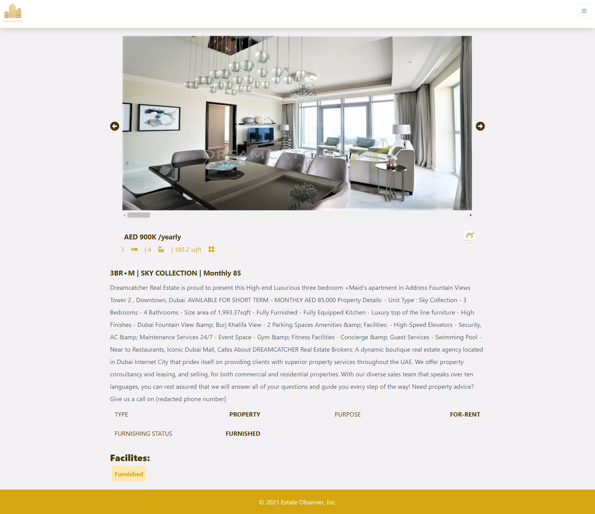

## Buy and Rent Estates in Dubai and Abu Dhabi

[Estate Observer](https://estate-observer.vercel.app/) is an app for finding estate available for buying or renting, you can filter your searches of the estates and find the proper home for yourself

This is a [Next.js](https://nextjs.org/) project bootstrapped with [`create-next-app`](https://github.com/vercel/next.js/tree/canary/packages/create-next-app).
, The Styling is made with [Chakra-ui](https://chakra-ui.com/) and [Emotion](https://emotion.sh/docs/introduction)
, The App is deployed on [Vercel](https://vercel.com/)

you can visit the website at [https://estate-observer.vercel.app/](https://estate-observer.vercel.app/)

## Homepage Page

## Search Page

## Property Page

